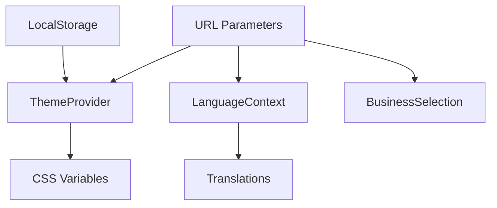

# StoryMaps Architecture Analysis Report

## Executive Summary

This document identifies unconventional patterns and architectural decisions in the StoryMaps codebase that deviate from conventional React/Next.js practices. These patterns warrant further analysis as they represent either innovative solutions or potential technical debt.

**Analysis Date:** February 2026
**Codebase Version:** Main branch
**Scope:** Full application architecture review

---

## Table of Contents

1. [Critical Unconventional Patterns](#1-critical-unconventional-patterns)
2. [Medium-Priority Patterns](#2-medium-priority-patterns)
3. [Low-Priority Observations](#3-low-priority-observations)
4. [Risk Assessment Matrix](#4-risk-assessment-matrix)
5. [Supplementary Methodologies](#5-supplementary-methodologies)
6. [Recommended Next Steps](#6-recommended-next-steps)

---

## 1. Critical Unconventional Patterns

### 1.1 Theme System with Intentionally Disabled ESLint Rules

**Location:** `/src/app/page.tsx` (lines 51-77), `/src/app/layout.tsx`

**Pattern Description:**
The theme system deliberately violates React's rules of hooks by using `// eslint-disable-next-line react-hooks/exhaustive-deps` to prevent an infinite loop caused by synchronizing URL parameters with the `next-themes` ThemeProvider.

```typescript
// Theme is read from URL ONCE on mount only
useEffect(() => {
  const urlTheme = searchParams.get('theme');
  if (urlTheme && themes.includes(urlTheme)) {
    setTheme(urlTheme);
  }
  // eslint-disable-next-line react-hooks/exhaustive-deps
}, []); // Intentionally empty - URL read only on mount
```

**Conventional Approach:**
- Store theme in localStorage via `next-themes` only
- Never sync theme state with URL parameters

**Why This Deviates:**
- Creates shareable theme links (`?theme=cool`)
- Prevents double-setting race condition between URL and ThemeProvider
- Requires explicit developer understanding of the intentional rule violation

**Risk Level:** HIGH
**Benefits:** Shareable themes, no flash on navigation
**Risks:** Violates React conventions, requires documentation to maintain

---

### 1.2 No CSS Color Transitions (Global Restriction)

**Location:** `/src/app/globals.css` (lines 5-7)

**Pattern Description:**
The entire application explicitly prohibits CSS transitions on `background-color` and `color` properties to prevent visual flashing during theme switches.

```css
/* CRITICAL: Theme transitions disabled to prevent flashing
   DO NOT add transitions to background-color or color properties
   This will cause themes to flash when switching */
```

**Conventional Approach:**
- Use smooth 200-300ms transitions for color changes
- Apply `prefers-reduced-motion` media query for accessibility

**Why This Deviates:**
- Instant color changes feel "jarring" by modern UI standards
- Prevents the visible "flash of wrong theme" during hydration
- Historical content sensitivity may warrant professional, print-like aesthetic

**Risk Level:** MEDIUM
**Benefits:** No theme flashing, immediate visual feedback
**Risks:** Less polished feel, unusual user experience expectation

---

### 1.3 Global Variable API Response Cache

**Location:** `/src/app/api/storymaps/route.ts` (line 10)

**Pattern Description:**
API responses are cached in a module-level global variable without any invalidation strategy, time-to-live, or cache busting mechanism.

```typescript
let cachedData: any[] | null = null;

async function getStoryMaps() {
  if (cachedData) return cachedData;
  const data = await fs.readFile(DATA_FILE_PATH, 'utf8');
  cachedData = JSON.parse(data);
  return cachedData;
}
```

**Conventional Approach:**
- Use Next.js ISR with `revalidate` option
- Implement SWR or React Query with stale-while-revalidate
- Use Redis or similar for production caching

**Why This Deviates:**
- Zero dependency caching solution
- Persists across all requests in same server instance
- No way to invalidate cache without server restart

**Risk Level:** MEDIUM
**Benefits:** Simple, zero-overhead caching
**Risks:** Stale data, no invalidation, memory leak potential

---

## 2. Medium-Priority Patterns

### 2.1 Hydration-Safe Mounted Check Pattern

**Location:** `/src/hooks/useIsMounted.ts`

**Pattern Description:**
A custom `useIsMounted()` hook that returns `false` on server and `true` only after client-side hydration completes. Used throughout the app to conditionally render theme-dependent UI.

**Analysis:**
- Forces client-side rendering for theme-aware components
- Adds ~16ms delay before theme UI is interactive
- More explicit than `typeof window !== 'undefined'` checks

**Recommendation:** Document as standard pattern; consider replacing with `useSyncExternalStore` for better React 18 compatibility.

---

### 2.2 URL Parameters as Primary State Source

**Location:** `/src/app/page.tsx` (multiple locations)

**Pattern Description:**
Application state is synchronized bidirectionally with URL parameters:
- `?theme=moody` - Theme preference
- `?lang=de` - Language selection
- `?id=business-123` - Selected business
- `?about=true` - Info panel visibility

Uses `router.replace()` instead of `router.push()` to avoid polluting browser history.

**Analysis:**
- Enables deep linking to specific application states
- Complicates state management (dual source of truth)
- Can cause race conditions if not carefully managed

**Recommendation:** Extract URL state management into dedicated hook or use `nuqs` library for type-safe URL state.

---

### 2.3 Device Capability Detection

**Location:** `/src/hooks/useMobileOptimizations.ts`

**Pattern Description:**
Uses experimental Navigator APIs to detect device capabilities:
- `navigator.deviceMemory` - RAM amount
- `navigator.hardwareConcurrency` - CPU cores
- `navigator.connection` - Network speed

Returns adaptive settings (max markers, animations, etc.) based on device tier.

**Analysis:**
- Excellent accessibility for low-end devices
- Uses actual device capabilities vs user agent sniffing
- APIs have poor browser support (Chrome-only for some)

**Recommendation:** Add fallback detection using `window.matchMedia` for reduced motion and screen size as proxy for capability.

---

### 2.4 SSR Language Fallbacks

**Location:** `/src/i18n/useTranslationNew.ts` (lines 70-87)

**Pattern Description:**
The translation hook includes hardcoded English fallback strings for SSR to prevent hydration mismatches.

```typescript
if (typeof window === 'undefined' || !i18n.isInitialized) {
  const englishFallbacks = {
    'mainPage.intro.title': 'Jewish Businesses',
    // ... more fallbacks
  };
  return englishFallbacks[path] || path;
}
```

**Analysis:**
- Prevents hydration errors from translation mismatches
- Requires manual maintenance of fallback strings
- Could diverge from actual translation files

**Recommendation:** Generate fallback object from translation files at build time.

---

## 3. Low-Priority Observations

### 3.1 Aggressive Memoization Strategy
- 208 instances of `React.memo()` across 71 files
- All callbacks wrapped in `useCallback()`
- May obscure real performance issues without profiling data

### 3.2 Strategic `any` Type Usage
- Used for Navigator APIs with poor TypeScript support
- Always accompanied by `eslint-disable` comment
- Pragmatic approach for experimental browser APIs

### 3.3 Hoefe Theme Typography Overrides
- Uses `!important` extensively for font family changes
- Scoped to single theme via `[data-theme='hoefe']` selector
- Could cause debugging difficulties

### 3.4 Mapbox Marker Caching with Ref
- Caches rendered React elements in `useRef` Map
- Reduces unnecessary DOM mutations
- Requires manual cache invalidation

### 3.5 Dual Dataset Loading
- Loads both full dataset and filtered "stories" subset
- Two API calls per page load
- Could be consolidated with query parameter

---

## 4. Risk Assessment Matrix

| Pattern | Severity | Likelihood | Impact | Priority |
|---------|----------|------------|--------|----------|
| Disabled ESLint for theme | HIGH | Medium | High | P1 |
| No color transitions | MEDIUM | Low | Medium | P2 |
| Global API cache | MEDIUM | Medium | Medium | P2 |
| URL state synchronization | MEDIUM | Medium | Low | P3 |
| Device capability detection | MEDIUM | Low | Low | P3 |
| SSR language fallbacks | MEDIUM | Medium | Low | P3 |
| Aggressive memoization | LOW | Low | Low | P4 |
| Strategic `any` usage | LOW | Low | Low | P4 |

---

## 5. Supplementary Methodologies

### 5.1 Static Analysis Tools

**Recommended additions to CI/CD pipeline:**

```bash
# Bundle size analysis
npm install -D @next/bundle-analyzer
ANALYZE=true npm run build

# Dependency audit
npm audit
npx depcheck

# TypeScript strict mode check
npx tsc --noEmit --strict

# Lighthouse CI
npm install -D @lhci/cli
lhci autorun
```

### 5.2 Performance Profiling

**React DevTools Profiler:**
1. Record interaction during theme switch
2. Identify unnecessary re-renders
3. Validate memo() effectiveness

**Next.js Analytics:**
```javascript
// next.config.js
module.exports = {
  experimental: {
    webVitals: true,
  },
};
```

### 5.3 Hydration Debugging

```javascript
// Add to layout.tsx for development
if (process.env.NODE_ENV === 'development') {
  const originalError = console.error;
  console.error = (...args) => {
    if (args[0]?.includes?.('Hydration')) {
      console.trace('Hydration mismatch:');
    }
    originalError.apply(console, args);
  };
}
```

### 5.4 State Management Audit

**Create state flow diagram:**


---

## 6. Recommended Next Steps

### Immediate Actions (P1)

1. **Document Theme System Behavior**
   - Create `/docs/THEME_SYSTEM_ARCHITECTURE.md`
   - Explain why ESLint rule is disabled
   - Add unit tests for theme synchronization

2. **Add Cache Invalidation to API**
   ```typescript
   // Option 1: TTL-based cache
   let cacheTime = 0;
   const CACHE_TTL = 5 * 60 * 1000; // 5 minutes

   if (Date.now() - cacheTime > CACHE_TTL) {
     cachedData = null;
   }

   // Option 2: Use Next.js revalidation
   export const revalidate = 300; // 5 minutes
   ```

### Short-Term Actions (P2)

3. **Extract URL State Management**
   - Create `useUrlState()` hook
   - Consider `nuqs` library for type safety
   - Centralize URL parameter handling

4. **Add Device Capability Fallbacks**
   ```typescript
   const getDeviceTier = () => {
     if (navigator.deviceMemory) return detectByMemory();
     if (window.matchMedia('(prefers-reduced-motion: reduce)').matches) return 'low';
     if (window.innerWidth < 768) return 'medium';
     return 'high';
   };
   ```

### Medium-Term Actions (P3)

5. **Generate SSR Fallbacks at Build Time**
   ```javascript
   // scripts/generate-ssr-fallbacks.js
   const translations = require('../public/locales/en/common.json');
   const fallbacks = Object.entries(translations).reduce((acc, [key, value]) => {
     acc[key] = value;
     return acc;
   }, {});
   fs.writeFileSync('src/i18n/ssr-fallbacks.json', JSON.stringify(fallbacks));
   ```

6. **Implement Performance Monitoring**
   - Add React Profiler to development builds
   - Track Core Web Vitals in production
   - Create performance regression tests

### Long-Term Actions (P4)

7. **Refactor Memoization Strategy**
   - Profile actual render performance
   - Remove unnecessary memo() calls
   - Document components that truly benefit

8. **Consolidate Dataset Loading**
   - Single API call with query parameter for mode
   - Server-side filtering instead of dual datasets

---

## Appendix: Files Referenced

| File | Lines | Primary Concern |
|------|-------|-----------------|
| `/src/app/page.tsx` | 51-77 | Theme URL sync |
| `/src/app/layout.tsx` | 195-218 | ThemeProvider config |
| `/src/app/globals.css` | 5-7, 10-393 | Theme variables |
| `/src/hooks/useIsMounted.ts` | all | Hydration safety |
| `/src/hooks/useMobileOptimizations.ts` | all | Device detection |
| `/src/i18n/useTranslationNew.ts` | 70-87 | SSR fallbacks |
| `/src/app/api/storymaps/route.ts` | 9-30 | API caching |

---

*This document should be reviewed and updated after each major architectural change.*
